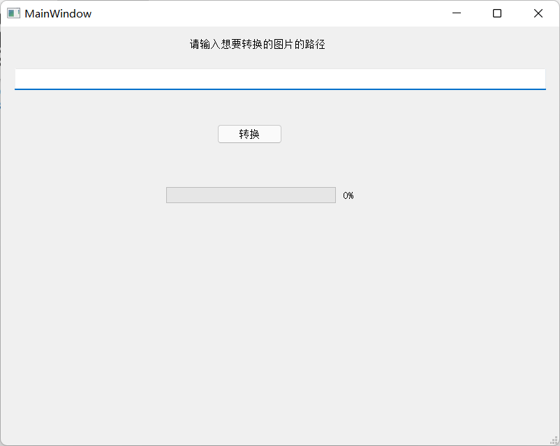

# 使用说明

## 功能介绍

tools-box整合了CSV-xlsx文件格式转换、图片转txt字符画、字符串生成二维码图片、URL网址目录检测/IP扫描四个部分的功能。

## 主页面

## 工具一 CSV-xlsx文件格式转换

支持文件类型为xlsx或xls与csv文件类型之间的相互转换，该模块以第三方库xlrd、codecs、csv以及pandas四个库组成实现，通过以分行读取目标文件，并将按行读取的内容写入内存，最终保存到新文件实现格式转换。

### 运行方式

选择转换格式的方式，然后文本输入框才可以操作，按照提示输入路径和转换后文件名就能在运行程序的目录下生成相应文件

### 运行截图

会在运行程序的根目录下生成文件

## 工具二 图片转txt字符画

用于把图片转换成TXT文件的Python小工具,用到了pillow等第三方库.原理是打开一幅图片,先对图片进行格式转换和缩放,然后对图像二值化,转换成纯黑白的图像,接着依次读取图片每个像素的值写入到文本文件中,如果该值不为0则写入@,否则写入空格.

### 运行方式

输入要转换的图片的路径，点击转换

### 运行截图

如果输入路径错误会导致生成图片失败

## 工具三 字符串生成二维码图片

第二个工具用来生成二维码，用到了qrcode等第三方库，输入要生成二维码的图片文件等，然后输出生成的二维码到指定路径上.

### 运行方式

### 运行截图

## 工具四 URL网址目录检测和IP扫描

### Port模块介绍（IP扫描）

#### 项目功能介绍

端口扫描是渗透测试中信息收集里很重要的一个部分，厉害的黑客或者渗透工程师，仅仅通过扫描服务器端口的开启情况就能够大致判断出网站的类型以及开启的服务。这里port模块主要是用来扫描服务器的端口开启情况。这里使用到了multiprocessing.dummy库，因为需要提高扫描的效率，所以也需要使用到多线程，然后我们需要设置扫描的服务器IP,以及连接的时间，这里因为测试时使用的是校园网，所以这里连接时间可以适当的延长：

图 1 port连接部分

接下来是端口扫描部分，使用socket来创建连接，然后对于函数的比较详细的解释也已经写到了注释中：

图 2 端口扫描部分

#### 程序运行方式

这里程序的运行方式是只需设置好IP就可以直接点击run运行了，在如下位置设置需要扫描的IP：

图 3 IP输入位置

#### 程序运行截图

这里测试程序时为了避免造成不必要的网络安全问题，使用的是我自己的VPS：

图 4 扫描结果

这里可以看到扫描的效率还是可以的，并且也是正确的扫描出了结果。

### scanbak模块介绍（URL检测）

#### 项目功能简介

这是一个在渗透测试中扫描文件敏感目录的脚本，因为渗透测试中，信息收集是很重要的一个阶段，前期信息收集的工作直接决定了渗透工作的效果，虽然现在市面上的自动化信息收集工具有很多，但是有的时候功能过于集中，这里这个脚本主要是用来扫描网站的敏感文件目录。

程序主要是实现了扫描敏感文件目录是否存在，以及当文件存在时，读出文件的大小，同时为了提高扫描的效率这里使用了多线程操作：

1. 敏感文件扫描功能：

   

   图 1 url补全模块

这里对于网站敏感目录的识别方式，主要是通过在url后面加上字典中存储的常见的敏感文件目录名。

1. 敏感文件输出模块：

   

   图 2 敏感文件输出模块

这里对于文件大小的识别主要是通过信息报文中的Content-Length消息头的数据。并通过Content-Type消息头来判断文件的类型。

#### 程序运行方式

程序的运行方式是通过命令行运行，这里需要传入两个参数，第一个是需要运行的程序的文件名，以及想要扫描的文件目录，如下所示：

图 3 命令行运行

这里为了防止输入错误，导致程序崩溃，也做了输入的检测，如果输入的参数不正确也会报错：

图 4 输入报错

#### 程序运行截图

此界面上端输入存储URL网址的txt文件的路径，点击url网址检测运行：

这里程序运行完以后的数据会写入到当前文件夹的bak.txt文件中，为了避免有什么问题，这里我们在本地用phpstudy搭建一个web服务器测试一下：

图 5 测试网站

这里在url.txt文件中写入本地web服务器的url，然后运行程序查看结果：

图 6 扫描结果

这里可以看到程序正确扫描出了我放在WWW目录下的几个敏感文件。
